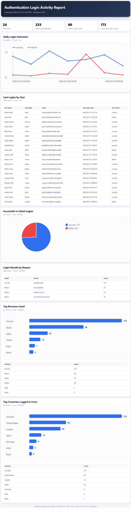

# dbreport

`dbreport` is a small Go command-line tool that runs MariaDB queries and turns
results into self-contained HTML reports.

It fits teams that need dependable operational reports without standing up a
web app, BI platform, or PDF pipeline. A report is driven by YAML config and can
be generated on demand or from schedulers such as cron.

Common use cases include daily operational snapshots, login and auth trend
monitoring, support and incident summaries, and lightweight stakeholder status
reports.

## What dbreport does

- Connects to MariaDB using `database/sql`.
- Executes configured read-oriented queries with guardrails.
- Renders compact HTML reports with inline CSS and inline SVG.
- Supports metric tiles, tables, bar charts, line charts, and pie charts.
- Optionally emails the generated report over SMTP.
- Runs as a single binary with config and environment variables.

## Safety posture

`dbreport` is designed for safe, repeatable reporting:

- Query validation and reporting-focused query policy checks.
- Per-query timeout and row-limit controls.
- Secrets loaded from environment variables.
- Self-contained HTML output with restrictive CSP and no external assets.
- No arbitrary SQL execution from CLI arguments.

See `docs/SECURITY.md` and `docs/SECURITY_MODEL.md` for details.

## Commands

```text
dbreport --help
dbreport help
dbreport version
dbreport about
dbreport sample-config
dbreport check --config report.yml
dbreport run --config report.yml
dbreport run --config report.yml --output reports/daily.html
dbreport run --config report.yml --email
dbreport run --config report.yml --no-email
```

## Quick start

Generate a sample configuration:

```sh
dbreport sample-config > report.yml
```

Set database credentials through environment variables:

```sh
export DBREPORT_DB_USER='report_user'
export DBREPORT_DB_PASSWORD='change-me'
```

Validate configuration and DB/query access:

```sh
dbreport check --config report.yml
```

Generate a report:

```sh
dbreport run --config report.yml
```

Generate to a custom output path:

```sh
dbreport run --config report.yml --output reports/daily.html
```

Send report email (optional SMTP):

```sh
export DBREPORT_SMTP_USER='smtp-user'
export DBREPORT_SMTP_PASSWORD='smtp-password'
dbreport run --config report.yml --email
```

## Configuration overview

Primary config file name:

```text
report.yml
```

Example:

```yaml
title: "Daily MariaDB Summary"

output:
  html: "report.html"

database:
  host: "127.0.0.1"
  port: 3306
  name: "appdb"
  user_env: "DBREPORT_DB_USER"
  password_env: "DBREPORT_DB_PASSWORD"
  timeout_seconds: 10
  tls: false

limits:
  max_rows_per_query: 1000

email:
  enabled: false
  smtp_host: "smtp.example.com"
  smtp_port: 587
  starttls: true
  username_env: "DBREPORT_SMTP_USER"
  password_env: "DBREPORT_SMTP_PASSWORD"
  from: "reports@example.com"
  to:
    - "ops@example.com"
  subject: "Daily MariaDB Summary"
  send_html_body: true
  attach_html: false

queries:
  - id: "total_orders"
    title: "Total Orders"
    type: "metric"
    sql: |
      SELECT COUNT(*) AS value
      FROM orders
```

See `docs/CONFIGURATION.md` and `docs/REPORT_SECTIONS.md` for full schema and
section contracts.

## Sample report

The sample below is rendered from the generated HTML report output.



A generated HTML sample report is also included at:

```text
docs/assets/sample-report.html
```

The sample is produced by the optional MariaDB smoke-test dataset using fake user data and reserved example domains. It is intended to show the current report layout, metric tiles, charts, tables, inline SVG rendering, and self-contained HTML output.
## Security notes

Recommended defaults:

- Use a read-only MariaDB account.
- Use least-privilege grants for only required reporting tables.
- Store DB and SMTP secrets in environment variables.
- Do not put secrets in `report.yml`.
- Avoid reporting sensitive fields unless recipients are approved.
- Use TLS/STARTTLS where available.
- Be careful when emailing reports externally.

## Optional MariaDB integration smoke test

Run end-to-end report generation against a temporary MariaDB instance:

```sh
./scripts/integration_mariadb_smoke.sh
```

The script prefers local MariaDB runtime first, falls back to Docker, or exits
with a clear skip message.

To regenerate the committed sample report:

```sh
DBREPORT_KEEP_SAMPLE_REPORT=1 ./scripts/integration_mariadb_smoke.sh
```

## Build and development validation

```sh
go mod tidy
gofmt -w ./cmd ./internal
go test ./...
go build ./cmd/dbreport
./scripts/check_release.sh
go vet ./...
```

## License

MIT License.

Copyright (c) 2026 Richard S. Westmoreland

## Author

Richard S. Westmoreland

dev@rswestmore.land
